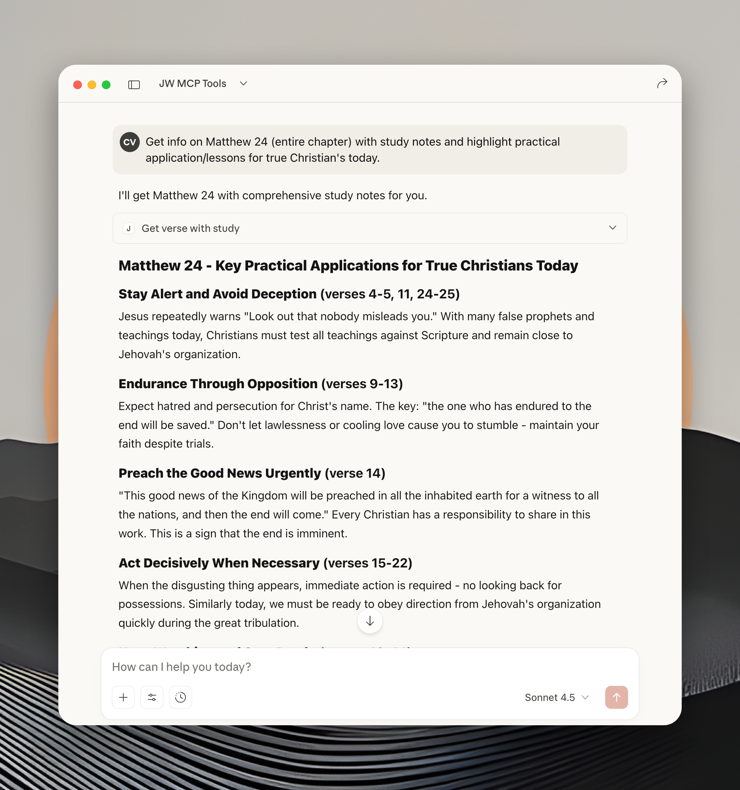
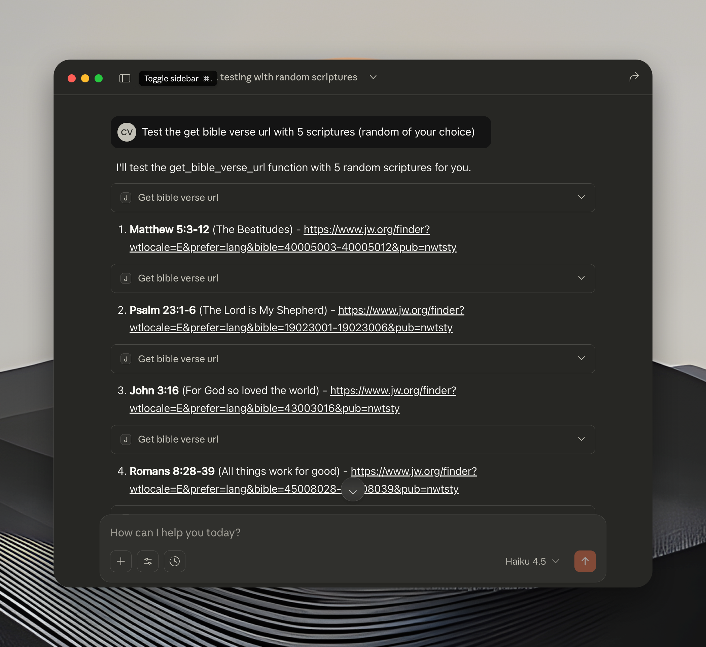
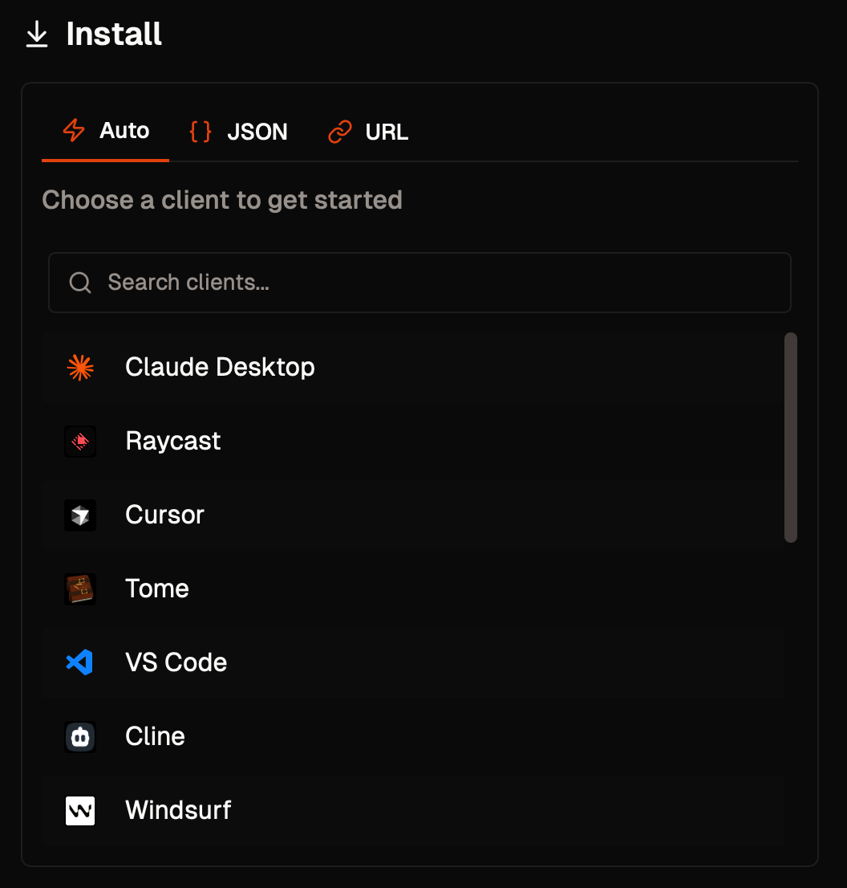

# JW MCP Server
[](https://smithery.ai/server/@advenimus/jw-mcp)

An MCP (Model Context Protocol) server that provides tools for working with JW.org content, including workbook materials, Watchtower articles, video captions, and comprehensive Bible scripture lookup with study content.

## Features

This MCP server provides four main categories of tools:

### 📖 **Bible Scripture Tools** (NEW!)
- **`search_bible_books`**: Search for Bible books by name or abbreviation to find book numbers
- **`get_bible_verse`**: Get plain Bible verse text from wol.jw.org
- **`get_verse_with_study`**: Get comprehensive study content including verses, study notes, cross-references, and research articles. Supports verse ranges.
- **`get_bible_verse_url`**: Generate JW.org URLs for Bible verses, ranges, or chapters. Perfect for adding clickable scripture links to markdown documents.




### 📚 **Christian Life and Ministry Workbook Tools**
- **`getWorkbookLinks`**: Get available workbook weeks for current or specific issue
- **`getWorkbookContent`**: Download and parse RTF content to clean plain text (70% token reduction!)


### 📰 **Watchtower Study Tools**
- **`getWatchtowerLinks`**: Get available Watchtower articles for current or specific issue
- **`getWatchtowerContent`**: Download and parse RTF content to clean plain text (70% token reduction!)


### 🎥 **Video Caption Tools**
- **`get_jw_captions`**: Retrieves video metadata and subtitle content from JW.org by video ID


### ⚡ **Smart Features**
- **Automatic Date Handling**: Workbook uses current month; Watchtower automatically calculates correct issue (2 months behind)
- **RTF Parsing**: Automatically converts RTF files to clean, readable plain text with 70% token reduction
- **Live Web Scraping**: Scripture tools fetch fresh content directly from wol.jw.org with no database required

## What's New 🎉

### Latest Updates
- **NEW Scripture Tools**: Search Bible books, get verses, and comprehensive study content with notes and research articles
- **RTF Parser**: Watchtower and Workbook tools now return clean, formatted text instead of raw RTF (70% smaller!)
- **Web Scraping**: Live scripture lookup from wol.jw.org with verse-specific study notes and cross-references

# Quick Start

## Installation

### Installing via Smithery (Recommended)

To install jw-mcp for Claude Desktop automatically via [Smithery](https://smithery.ai/server/@advenimus/jw-mcp):

On this page, click the relevant install option for your client



## Manual Local Install

1. Clone this repository
2. Install dependencies:
   ```bash
   npm install
   ```

### Claude Desktop Setup
If cloned manually to a folder on your system, update your Claude Desktop config (`~/Library/Application Support/Claude/claude_desktop_config.json`):

```json
{
  "mcpServers": {
    "jw-mcp": {
      "command": "node",
      "args": ["/Users/<username>/jw-mcp/src/index.js"]
    }
  }
}
```

**Replace `/Users/<username>/jw-mcp` with your actual project path.**

## Available Tools

### 📖 Bible Scripture Tools

#### `search_bible_books`
Search for Bible books by name, abbreviation, or number. Useful for finding the correct book number to use with other scripture tools.

**Input:**
- `query` (required): Search query - can be book name, abbreviation, or number
- `limit` (optional): Maximum results to return (default: 10)

**Examples:**
```json
{
  "query": "matthew"
}

{
  "query": "1 john"
}

{
  "query": "gen"
}
```

**Output:**
```json
{
  "query": "matthew",
  "results_count": 1,
  "books": [
    {
      "number": 40,
      "name": "Matthew",
      "testament": "New Testament",
      "relevance_score": 100
    }
  ]
}
```

#### `get_bible_verse`
Get plain Bible verse text from wol.jw.org. Returns just the verse text without study notes.

**Input:**
- `book` (required): Bible book number (1-66)
- `chapter` (required): Chapter number
- `verse` (required): Verse number

**Bible Book Reference:**
| Range | Testament | Examples |
|-------|-----------|----------|
| 1-39  | Old Testament | Genesis=1, Psalms=19, Isaiah=23 |
| 40-66 | New Testament | Matthew=40, John=43, Revelation=66 |

**Example:**
```json
{
  "book": 43,
  "chapter": 3,
  "verse": 16
}
```

**Output:**
```json
{
  "reference": "John 3:16",
  "book_number": 43,
  "book_name": "John",
  "chapter": 3,
  "verse": 16,
  "text": "16 \"For God loved the world so much that he gave his only-begotten Son,+ so that everyone exercising faith in him might not be destroyed but have everlasting life.+"
}
```

#### `get_bible_verse_url`
Generate JW.org URLs for Bible verses, verse ranges, or entire chapters. The URLs always open on JW.org and can be used to create clickable scripture links in markdown documents. Ideal for asking the LLM to edit markdown files and add links to each verse reference.

**Input:**
- `book` (required): Bible book number (1-66)
- `chapter` (required): Chapter number
- `verse` (optional): Verse reference - can be:
  - Single verse: `"18"`
  - Verse range: `"14-16"`
  - Comma-separated verses: `"1,3,5"` (converts to range if contiguous)
  - Omit for entire chapter URL

**Examples:**
```json
// Single verse
{
  "book": 19,
  "chapter": 83,
  "verse": "18"
}
// Returns: https://www.jw.org/finder?wtlocale=E&prefer=lang&bible=19083018&pub=nwtsty

// Verse range
{
  "book": 23,
  "chapter": 46,
  "verse": "9-11"
}
// Returns: https://www.jw.org/finder?wtlocale=E&prefer=lang&bible=23046009-23046011&pub=nwtsty

// Entire chapter
{
  "book": 40,
  "chapter": 5
}
// Returns: https://www.jw.org/finder?wtlocale=E&prefer=lang&bible=40005&pub=nwtsty
```

**Use Cases:**
- Adding clickable links to scripture references in markdown documents
- Creating study guides with linked Bible verses
- Automating scripture link generation in bulk
- Building markdown files with proper JW.org references

#### `get_verse_with_study`
Get comprehensive study content for Bible verses. Supports single verses or ranges, with customizable field selection.

**Input:**
- `book` (required): Bible book number (1-66)
- `chapter` (required): Chapter number
- `verse` (required): Single verse ("14") or range ("14-16")
- `fields` (optional): Array of content fields to include (default: ["verses", "study_notes"])
  - `verses` - Verse text
  - `study_notes` - Verse-specific study notes
  - `study_articles` - Research Guide articles
  - `cross_references` - Related scripture references
  - `chapter_level` - Chapter outline and content
  - `combined_text` - All verses as single text
- `limit` (optional): Maximum study articles to return (default: 5)
- `fetch` (optional): Force fresh data from wol.jw.org (default: false)

**Examples:**

Single verse with study notes:
```json
{
  "book": 40,
  "chapter": 24,
  "verse": "14",
  "fields": ["verses", "study_notes"]
}
```

Verse range with all study content:
```json
{
  "book": 40,
  "chapter": 5,
  "verse": "3-5",
  "fields": ["verses", "combined_text", "study_notes", "study_articles"],
  "limit": 3
}
```

**Output Example:**
```json
{
  "reference": "Matthew 24:14",
  "book_number": 40,
  "book_name": "Matthew",
  "chapter": 24,
  "verse_range": "14",
  "verses": [
    {
      "book_num": 40,
      "book_name": "Matthew",
      "chapter": 24,
      "verse_num": 14,
      "verse_text": "14 And this good news of the Kingdom will be preached..."
    }
  ],
  "study_notes": {
    "14": [
      "good news of the Kingdom: The message about God's Kingdom..."
    ]
  },
  "study_articles": [
    {
      "title": "Jesus—The Way, p. 255",
      "url": "https://wol.jw.org/en/wol/...",
      "type": "research"
    }
  ],
  "study_notes_count": 1,
  "study_articles_count": 3
}
```

### 📚 Workbook Tools

#### `getWorkbookLinks`
Get available workbook weeks for downloading.

**Input:**
- `issue` (optional): Specific issue in YYYYMM00 format (defaults to current issue)
- `langwritten` (optional): Language code (defaults to 'E' for English)

**Example:**
```json
{
  "issue": "20250500",
  "langwritten": "E"
}
```

#### `getWorkbookContent`
Download and parse RTF content for a specific workbook week. Returns clean, formatted plain text.

**Input:**
- `url` (required): The RTF file URL from getWorkbookLinks results

**Output:**
```json
{
  "url": "https://cfp2.jw-cdn.org/a/...",
  "contentType": "application/rtf",
  "originalSize": 45678,
  "parsedText": "May 5-11\nTREASURES FROM GOD'S WORD\n...",
  "parsedSize": 12345
}
```

**Example:**
```json
{
  "url": "https://cfp2.jw-cdn.org/a/clm_E_202505_01.rtf"
}
```

### 📰 Watchtower Tools

#### `getWatchtowerLinks`
Get available Watchtower articles for downloading.

**Input:**
- `issue` (optional): Specific issue in YYYYMM00 format (defaults to current Watchtower issue)
- `langwritten` (optional): Language code (defaults to 'E' for English)

**Example:**
```json
{
  "issue": "20250300",
  "langwritten": "E"
}
```

#### `getWatchtowerContent`
Download and parse RTF content for a specific Watchtower article. Returns clean, formatted plain text.

**Input:**
- `url` (required): The RTF file URL from getWatchtowerLinks results

**Output:**
```json
{
  "url": "https://cfp2.jw-cdn.org/a/...",
  "contentType": "application/rtf",
  "originalSize": 52722,
  "parsedText": "STUDY ARTICLE\n\n\"Call the Elders\"...",
  "parsedSize": 15652
}
```

**Example:**
```json
{
  "url": "https://cfp2.jw-cdn.org/a/w_E_202509_01.rtf"
}
```

### 🎥 Video Caption Tools

#### `get_jw_captions`
Fetches video captions and metadata by video ID or URL.

**Input:**
- `video_id` (required): Either a direct JW.org video ID or a JW.org URL

**Supported Input Formats:**
- **Direct video ID**: `pub-jwbvod25_17_VIDEO`
- **JW.org finder URL**: `https://www.jw.org/finder?srcid=jwlshare&wtlocale=E&lank=pub-jwbvod25_17_VIDEO`
- **JW.org library URL**: `https://www.jw.org/en/library/videos/?docid=pub-jwbvod25_17_VIDEO`
- **JW.org direct link**: `https://www.jw.org/en/library/videos/pub-jwbvod25_17_VIDEO/`

**Output:**
- `title`: Video title
- `thumbnail`: Thumbnail image URL  
- `subtitles`: Complete subtitle content (VTT format)

**Examples:**
```json
// Using direct video ID
{
  "video_id": "pub-jwbvod25_17_VIDEO"
}

// Using JW.org URL (video ID automatically extracted)
{
  "video_id": "https://www.jw.org/finder?srcid=jwlshare&wtlocale=E&lank=pub-jwbvod25_17_VIDEO"
}
```

## Examples

### Search for Bible Books
```json
// Search for Matthew
{
  "tool": "search_bible_books",
  "query": "matthew"
}

// Search using abbreviation
{
  "tool": "search_bible_books",
  "query": "gen"
}
```


### Get Bible Verse
```json
// Get John 3:16 (plain text)
{
  "tool": "get_bible_verse",
  "book": 43,
  "chapter": 3,
  "verse": 16
}

// Get Matthew 24:14
{
  "tool": "get_bible_verse",
  "book": 40,
  "chapter": 24,
  "verse": 14
}
```


### Get Verse with Study Content
```json
// Get single verse with study notes
{
  "tool": "get_verse_with_study",
  "book": 43,
  "chapter": 3,
  "verse": "16",
  "fields": ["verses", "study_notes"]
}

// Get verse range with all study content
{
  "tool": "get_verse_with_study",
  "book": 40,
  "chapter": 5,
  "verse": "3-5",
  "fields": ["verses", "combined_text", "study_notes", "study_articles", "cross_references"],
  "limit": 5
}
```


### Get Bible Verse URL
```json
// Get URL for Psalm 83:18
{
  "tool": "get_bible_verse_url",
  "book": 19,
  "chapter": 83,
  "verse": "18"
}

// Get URL for verse range (Matthew 5:3-12)
{
  "tool": "get_bible_verse_url",
  "book": 40,
  "chapter": 5,
  "verse": "3-12"
}

// Get URL for entire chapter (John 3)
{
  "tool": "get_bible_verse_url",
  "book": 43,
  "chapter": 3
}
```

### Get Current Workbook Weeks
```json
// Step 1: Get all available weeks for current issue
{
  "tool": "getWorkbookLinks"
}

// Step 2: Download and parse specific week's content (returns clean text)
{
  "tool": "getWorkbookContent",
  "url": "https://cfp2.jw-cdn.org/a/clm_E_202505_01.rtf"
}
```


### Get Current Watchtower Articles
```json
// Step 1: Get all available articles for current studies
{
  "tool": "getWatchtowerLinks"
}

// Step 2: Download and parse specific article's content (returns clean text)
{
  "tool": "getWatchtowerContent",
  "url": "https://cfp2.jw-cdn.org/a/w_E_202509_01.rtf"
}
```


### Get Video Captions
```json
// Using direct video ID
{
  "tool": "get_jw_captions",
  "video_id": "pub-jwbvod25_17_VIDEO"
}

// Using JW.org URL (automatically extracts video ID)
{
  "tool": "get_jw_captions", 
  "video_id": "https://www.jw.org/finder?srcid=jwlshare&wtlocale=E&lank=pub-jwbvod25_17_VIDEO"
}
```

## How Date Handling Works

### Automatic Current Issue Detection
- **Workbook**: Always uses current month (e.g., May 2025 = `20250500`)
- **Watchtower**: Uses issue from 2 months ago (e.g., May 2025 = `20250300`)

### Why 2 Months Behind for Watchtower?
Watchtower studies are published 2 months ahead of their study period:
- **March 2025 issue** contains **May 2025 studies**
- **January 2025 issue** contains **March 2025 studies**

The server automatically calculates this offset, even handling year boundaries correctly (January 2025 → November 2024).

## Technical Details

### Architecture
- **Modular design**: Each tool category in separate files under `src/tools/`
- **Shared utilities**: Common functions in `rtf-utils.js` for API calls and date calculations
- **RTF Parsing**: Advanced RTF-to-text parser (`rtf-parser.js`) provides 70% token reduction by converting RTF markup to clean, formatted plain text
- **Bible tools**: Web scraping with `cheerio` for HTML parsing, Bible book mappings, and study content extraction from wol.jw.org
- **Auto-registration**: Server automatically loads and registers all tools

### Error Handling
- Invalid issue formats
- Network connectivity issues  
- Missing content or files
- API rate limiting

### Supported Languages
All tools support multiple languages via the `langwritten` parameter:
- `E` - English (default)
- `S` - Spanish  
- `F` - French
- And many others...

## Troubleshooting

### Common Issues

1. **"Could not read package.json" error**: Use absolute path in Claude Desktop config
2. **Server disconnects**: Ensure Node.js is installed and dependencies are available (`npm install`)
3. **Permission denied**: Make shell script executable (`chmod +x start-server.sh`)

### Testing
Test the server manually:
```bash
npm start
# or
./start-server.sh
```

## Development

Built with:
- Node.js with ES modules
- MCP SDK (@modelcontextprotocol/sdk)
- node-fetch for HTTP requests
- cheerio for HTML parsing and web scraping

## License

MIT 