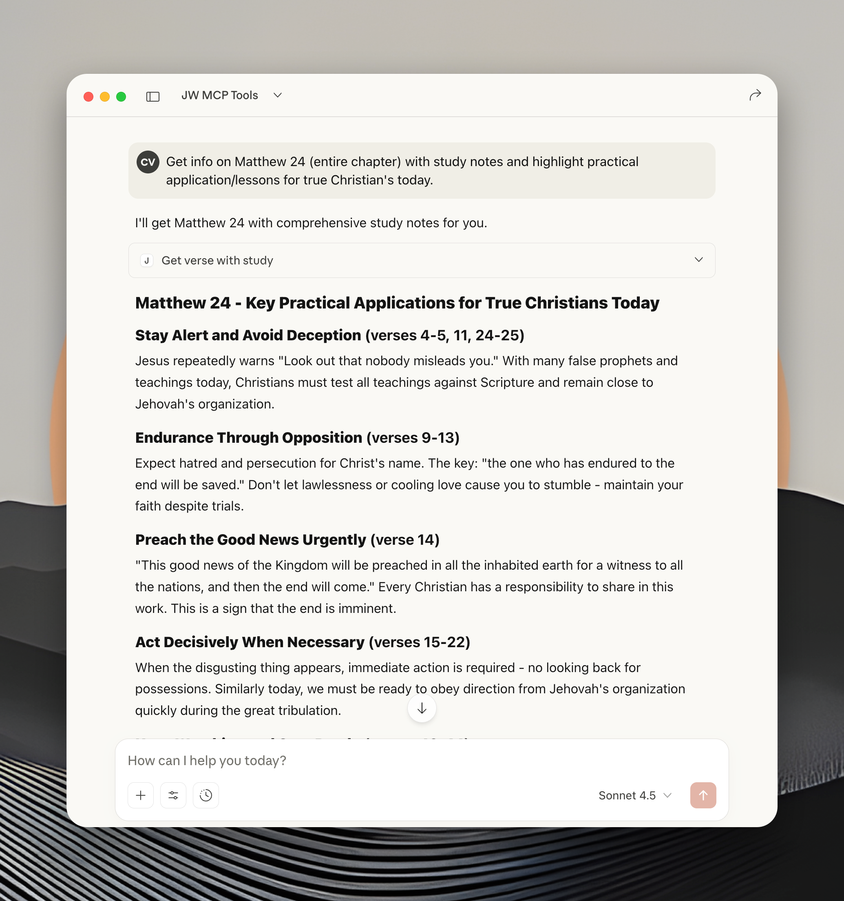
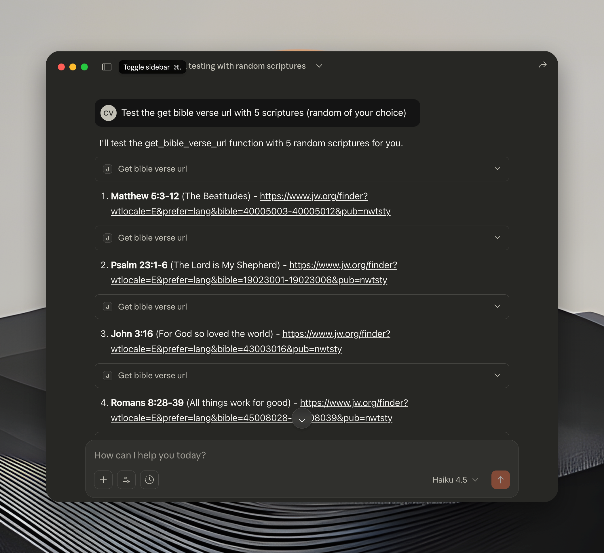
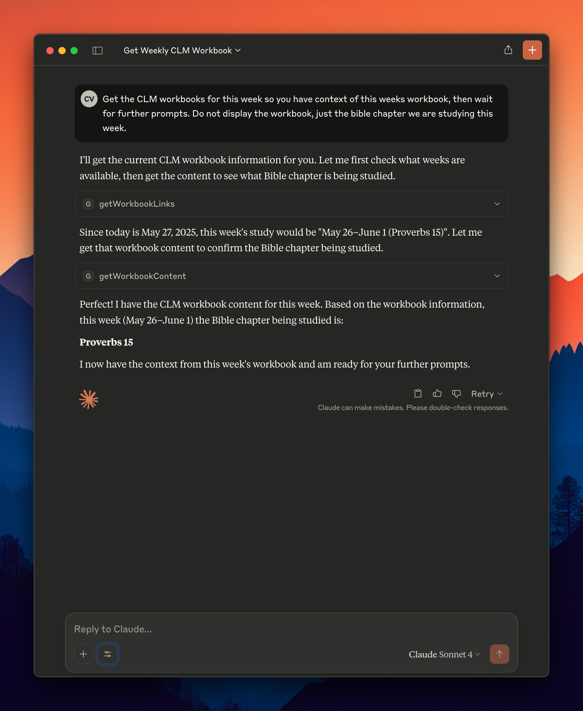
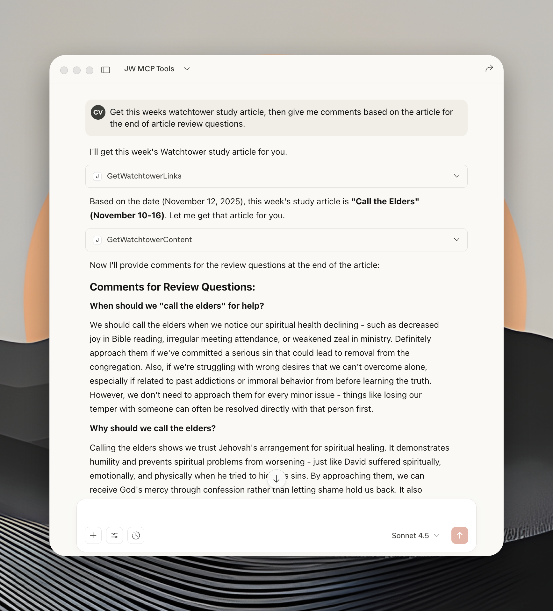
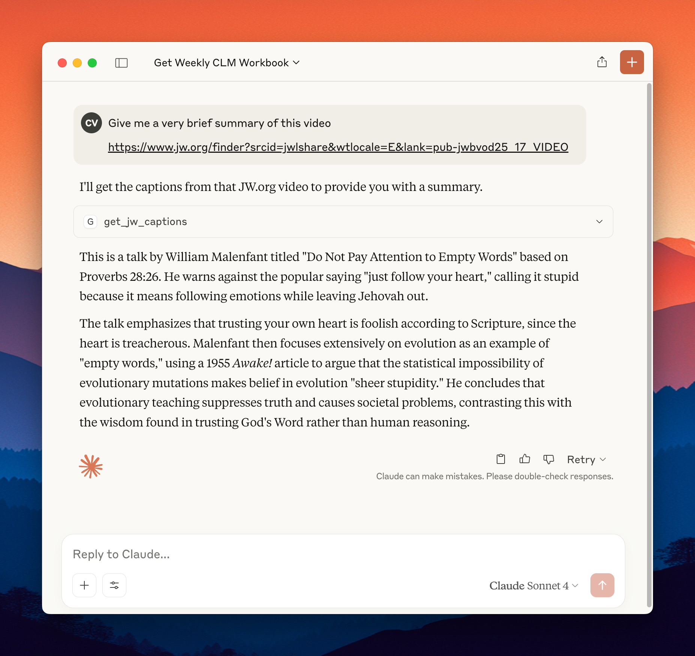

# JW MCP Server

[](https://www.npmjs.com/package/jw-mcp)
[](https://github.com/advenimus/jw-mcp/releases)

An MCP server for working with JW.org content — Bible scripture lookup with study notes, workbook materials, Watchtower articles, and video captions.

## Quick Start

### Claude Code (Recommended)

```bash
claude mcp add jw-mcp -- npx -y jw-mcp
```

### Claude Desktop

Download the latest `jw-mcp.mcpb` from [Releases](https://github.com/advenimus/jw-mcp/releases) and open it — Claude Desktop will install it automatically.

Or add manually to your config (`~/Library/Application Support/Claude/claude_desktop_config.json` on macOS, `%APPDATA%\Claude\claude_desktop_config.json` on Windows):

```json
{
  "mcpServers": {
    "jw-mcp": {
      "command": "npx",
      "args": ["-y", "jw-mcp"]
    }
  }
}
```

### Other MCP Clients (Cursor, Windsurf, etc.)

```bash
npx -y jw-mcp
```

---

## Tools

All tools support multiple languages via the `langwritten` parameter (`E` = English, `S` = Spanish, `F` = French, etc.).

### Bible Scripture Tools

#### `search_bible_books`
Search for Bible books by name, abbreviation, or number.

```json
{ "query": "matthew" }
```

#### `get_bible_verse`
Get plain verse text from wol.jw.org. Books are numbered 1-66 (1-39 OT, 40-66 NT).

```json
{ "book": 43, "chapter": 3, "verse": 16 }
```

#### `get_verse_with_study`
Get verses with study notes, cross-references, and research articles. Supports ranges.

```json
{
  "book": 40, "chapter": 5, "verse": "3-5",
  "fields": ["verses", "study_notes", "study_articles"]
}
```

Available fields: `verses`, `study_notes`, `study_articles`, `cross_references`, `chapter_level`, `combined_text`



#### `get_bible_verse_url`
Generate JW.org URLs for verses, ranges, or chapters — useful for adding clickable links to documents.

```json
{ "book": 19, "chapter": 83, "verse": "18" }
{ "book": 23, "chapter": 46, "verse": "9-11" }
{ "book": 40, "chapter": 5 }
```



---

### Workbook Tools

#### `getWorkbookLinks`
Get available Christian Life and Ministry workbook weeks for the current or a specific issue.

```json
{ "issue": "20250500", "langwritten": "E" }
```

#### `getWorkbookContent`
Download and parse a workbook week's RTF content to clean plain text (70% token reduction).

```json
{ "url": "https://cfp2.jw-cdn.org/a/clm_E_202505_01.rtf" }
```



---

### Watchtower Tools

#### `getWatchtowerLinks`
Get available Watchtower study articles. Automatically uses the correct issue (published 2 months ahead of study period).

```json
{ "issue": "20250300", "langwritten": "E" }
```

#### `getWatchtowerContent`
Download and parse a Watchtower article's RTF content to clean plain text (70% token reduction).

```json
{ "url": "https://cfp2.jw-cdn.org/a/w_E_202509_01.rtf" }
```



---

### Video Caption Tools

#### `get_jw_captions`
Fetch video captions and metadata by video ID or any JW.org URL.

```json
{ "video_id": "pub-jwbvod25_17_VIDEO" }
```

Also accepts full JW.org URLs — the video ID is extracted automatically.



---

## Troubleshooting

1. **"Could not read package.json"** — Use absolute path in Claude Desktop config
2. **Server disconnects** — Ensure Node.js is installed (`npm install`)
3. **Permission denied** — `chmod +x start-server.sh`

## Development

```bash
npm start          # stdio mode (local)
npm run start:http # HTTP mode (testing)
```

Built with Node.js, MCP SDK, node-fetch, and cheerio.

## License

MIT
