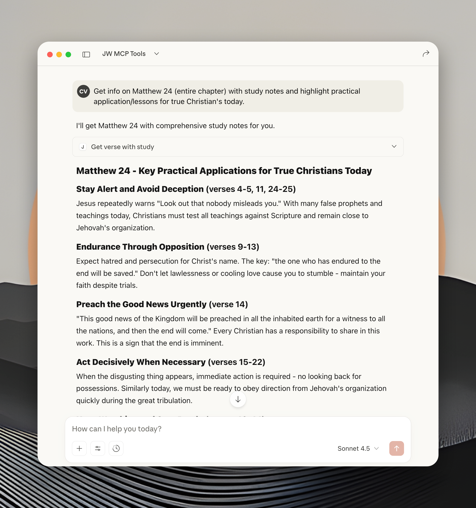
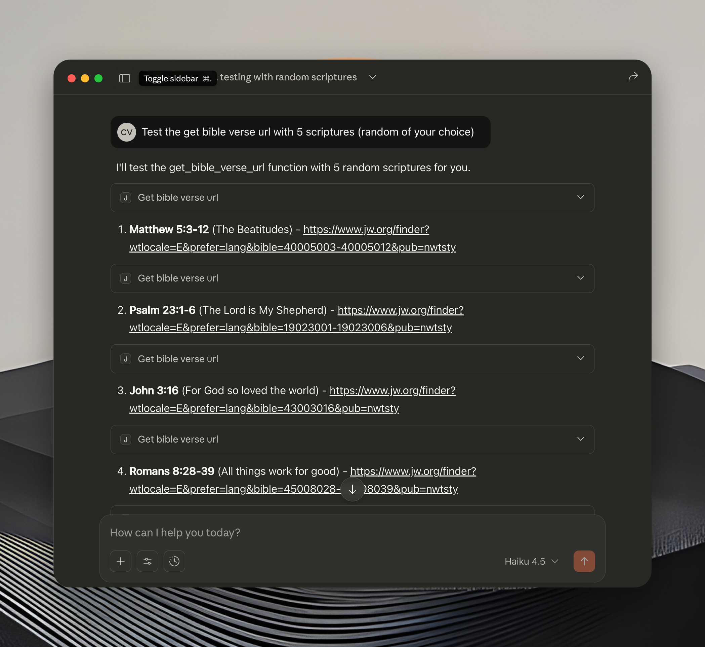
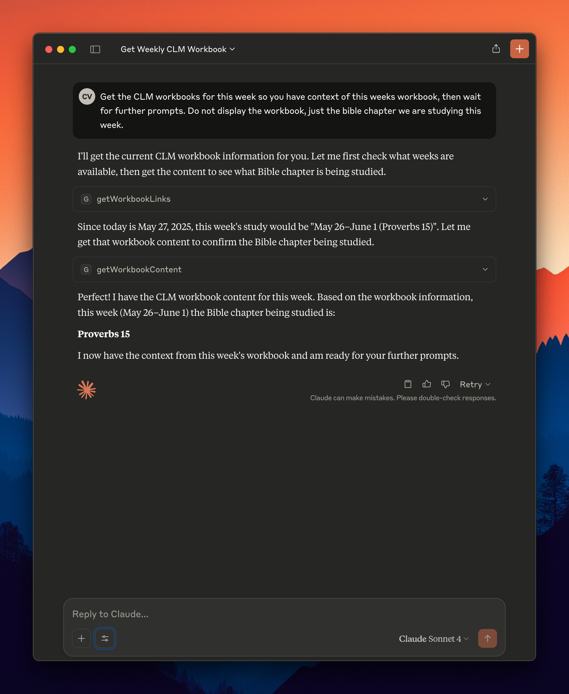
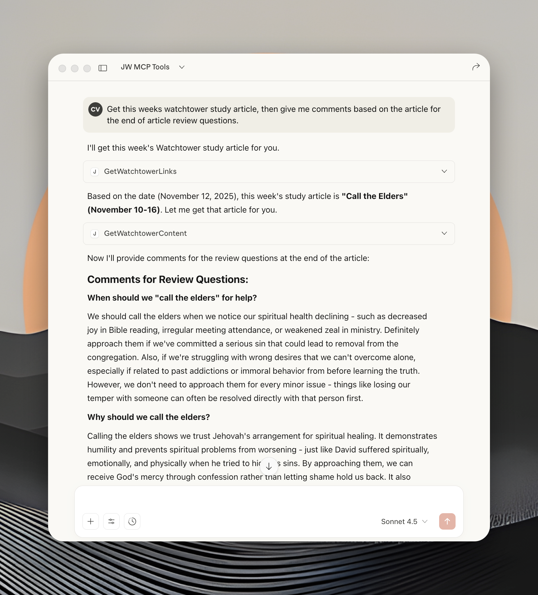
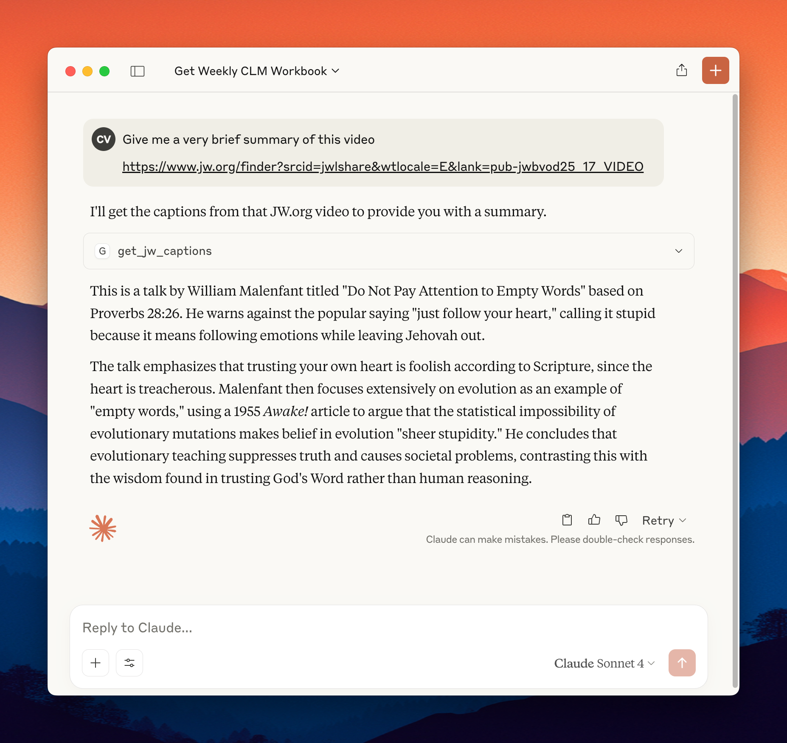

# JW MCP Server

[](https://www.npmjs.com/package/jw-mcp)
[](https://github.com/advenimus/jw-mcp/releases)

An MCP server for working with JW.org content — Bible scripture lookup with study notes, workbook materials, Watchtower articles, and video captions.

## Quick Start

### Claude Code (Recommended)

```bash
claude mcp add jw-mcp -- npx -y jw-mcp
```

### Claude Desktop

Download the latest `jw-mcp.mcpb` from [Releases](https://github.com/advenimus/jw-mcp/releases) and open it — Claude Desktop will install it automatically.

Or add manually to your config (`~/Library/Application Support/Claude/claude_desktop_config.json` on macOS, `%APPDATA%\Claude\claude_desktop_config.json` on Windows):

```json
{
  "mcpServers": {
    "jw-mcp": {
      "command": "npx",
      "args": ["-y", "jw-mcp"]
    }
  }
}
```

### Other MCP Clients (Cursor, Windsurf, etc.)

```bash
npx -y jw-mcp
```

---

## Docker (self-hosted)

Run this server on a machine with a public HTTPS URL, then paste that URL into Grok, Claude.ai, or ChatGPT as a custom connector.

Compose binds the container to loopback only (`127.0.0.1:8080`). Do not publish port 8080 on the public internet. Put a reverse proxy on the host, terminate TLS there, and proxy to `127.0.0.1:8080`.

> **Use port 443.** Claude.ai never connects to a custom connector on any other port. It only says "Couldn't reach the MCP server". Grok accepts other ports, so a URL like `https://host:18443/mcp` can work in Grok and still fail in Claude. The server logs a warning at startup when `MCP_BASE_URL` has a port.

1. Copy `.env.example` to `.env`.
2. Set `MCP_BASE_URL` to your public origin, with no path and no port. Example: `https://jw-mcp.example.com`.
3. Set `MCP_AUTH_SECRET` to a long access key (at least 16 characters).
4. Keep `MCP_AUTH=true`. HTTP mode with auth off is loopback-only. Do not disable auth in Docker.
5. Set `MCP_TRUST_PROXY=true` only when exactly one proxy sits in front of the server and sets or appends the real client IP in `X-Forwarded-For` (Caddy, nginx, or a Cloudflare Tunnel). Leave it unset otherwise.
6. Start it:

```bash
docker compose up --build -d
```

The connector URL is:

```
https://your-host/mcp
```

When you add the connector, the AI site opens a login page. Type the same access key you put in `MCP_AUTH_SECRET`.

| Client | Where to add it |
|---|---|
| Grok | [grok.com/connectors](https://grok.com/connectors) → New Connector → Custom |
| Claude.ai | Customize → Connectors → Add custom connector |
| ChatGPT | Settings → enable Developer mode → add the server URL |

Local HTTP (`http://localhost:8080`) is fine for testing because compose binds loopback. Claude, ChatGPT, and Grok must reach a public HTTPS URL. A tunnel such as ngrok or Cloudflare Tunnel can expose that loopback port for a live click-test. Do not publish `8080` on `0.0.0.0`.

Auth codes, clients, and tokens are stored in the `jw-mcp-auth` Docker volume so a container restart does not drop every connection.

### Home hosting with Cloudflare Tunnel

Use this when the server runs on a home or office network. The tunnel makes an outbound-only connection to Cloudflare, so you open no router ports and your home IP stays out of DNS. Requests to jw.org still leave from your own network. Your domain's DNS must be on Cloudflare.

1. In Cloudflare, go to **Zero Trust → Networks → Tunnels** and create a tunnel (type **Cloudflared**). Copy its token.
2. In the tunnel's **Public hostname** tab, add your hostname (for example `jw-mcp.example.com`) with service `http://jw-mcp:8080`. If a DNS record for that name already exists, delete it first.
3. In `.env`, set:

   ```bash
   MCP_BASE_URL=https://jw-mcp.example.com
   MCP_TRUST_PROXY=true
   CLOUDFLARE_TUNNEL_TOKEN=<token from step 1>
   ```

4. Start both containers:

   ```bash
   docker compose --profile tunnel up --build -d
   ```

5. Remove any old router port forward or reverse-proxy site for this server. Nothing needs to reach it from the internet directly.

If the tunnel doesn't come up, run `docker compose logs cloudflared`. A missing or wrong `CLOUDFLARE_TUNNEL_TOKEN` makes it restart over and over.

Cloudflare settings that can block AI connectors. Check them for this hostname:

- **Security → Bots:** keep Bot Fight Mode off. On the free plan it can't be skipped for one hostname, and it can challenge server-to-server calls from Claude and Grok.
- **AI Crawl Control / Block AI bots:** don't block Claude or Grok user agents on this hostname.
- **Cloudflare Access:** don't put an Access login in front of this hostname. Claude's servers can't pass it. The server's own access key already protects it.
- If you use WAF rules, allow Anthropic's outbound range `160.79.104.0/21`.

---

## Tools

All tools support multiple languages via the `langwritten` parameter (`E` = English, `S` = Spanish, `F` = French, etc.).

### Bible Scripture Tools

#### `search_bible_books`
Search for Bible books by name, abbreviation, or number.

```json
{ "query": "matthew" }
```

#### `get_bible_verse`
Get plain verse text from wol.jw.org. Books are numbered 1-66 (1-39 OT, 40-66 NT).

```json
{ "book": 43, "chapter": 3, "verse": 16 }
```

#### `get_verse_with_study`
Get verses with study notes, cross-references, and research articles. Supports ranges.

```json
{
  "book": 40, "chapter": 5, "verse": "3-5",
  "fields": ["verses", "study_notes", "study_articles"]
}
```

Available fields: `verses`, `study_notes`, `study_articles`, `cross_references`, `chapter_level`, `combined_text`



#### `get_bible_verse_url`
Generate JW.org URLs for verses, ranges, or chapters — useful for adding clickable links to documents.

```json
{ "book": 19, "chapter": 83, "verse": "18" }
{ "book": 23, "chapter": 46, "verse": "9-11" }
{ "book": 40, "chapter": 5 }
```



---

### Workbook Tools

#### `getWorkbookLinks`
Get available Christian Life and Ministry workbook weeks for the current or a specific issue.

```json
{ "issue": "20250500", "langwritten": "E" }
```

#### `getWorkbookContent`
Download and parse a workbook week's RTF content to clean plain text (70% token reduction).

```json
{ "url": "https://cfp2.jw-cdn.org/a/clm_E_202505_01.rtf" }
```



---

### Watchtower Tools

#### `getWatchtowerLinks`
Get available Watchtower study articles. Automatically uses the correct issue (published 2 months ahead of study period).

```json
{ "issue": "20250300", "langwritten": "E" }
```

#### `getWatchtowerContent`
Download and parse a Watchtower article's RTF content to clean plain text (70% token reduction).

```json
{ "url": "https://cfp2.jw-cdn.org/a/w_E_202509_01.rtf" }
```



---

### Video Caption Tools

#### `get_jw_captions`
Fetch video captions and metadata by video ID or any JW.org URL.

```json
{ "video_id": "pub-jwbvod25_17_VIDEO" }
```

Also accepts full JW.org URLs — the video ID is extracted automatically.



---

## Troubleshooting

1. **"Could not read package.json"** — Use absolute path in Claude Desktop config
2. **Server disconnects** — Ensure Node.js is installed (`npm install`)
3. **Permission denied** — `chmod +x start-server.sh`

## Development

```bash
npm start          # stdio mode (local)
npm run start:http # HTTP mode (testing)
npm test           # OAuth + HTTP connector tests
```

Built with Node.js, MCP SDK, node-fetch, and cheerio.

## License

MIT
