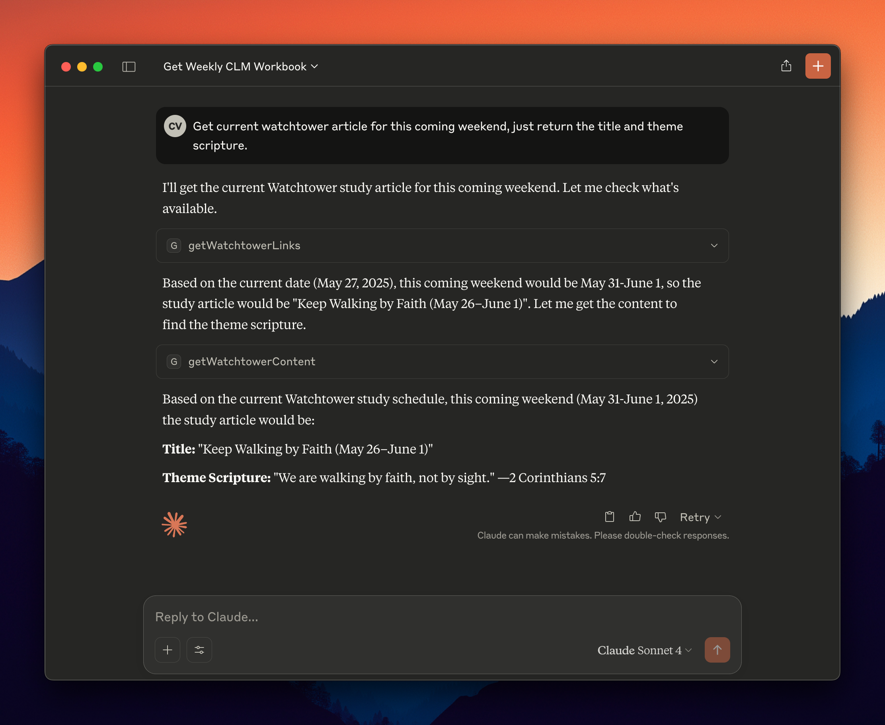

# JW MCP Server
[](https://smithery.ai/server/@advenimus/jw-mcp)

An MCP (Model Context Protocol) server that provides tools for working with JW.org content, including workbook materials, Watchtower articles, and video captions.

## Features

This MCP server provides three main categories of tools:

### 📚 **Christian Life and Ministry Workbook Tools**
- **`getWorkbookLinks`**: Get available workbook weeks for current or specific issue
- **`getWorkbookContent`**: Download RTF content for specific workbook weeks


### 📰 **Watchtower Study Tools** 
- **`getWatchtowerLinks`**: Get available Watchtower articles for current or specific issue
- **`getWatchtowerContent`**: Download RTF content for specific Watchtower articles



### 🎥 **Video Caption Tools**
- **`get_jw_captions`**: Retrieves video metadata and subtitle content from JW.org by video ID


### ⚡ **Smart Date Handling**
All tools automatically handle current dates:
- **Workbook tools**: Use current month (May 2025)
- **Watchtower tools**: Use issue from 2 months ago (March 2025) since Watchtower studies are published 2 months ahead

## Quick Start

### Installation

### Installing via Smithery

To install jw-mcp for Claude Desktop automatically via [Smithery](https://smithery.ai/server/@advenimus/jw-mcp):

```bash
npx --yes @smithery/cli install-protocol @advenimus/jw-mcp --client claude
```

1. Clone this repository
2. Install dependencies:
   ```bash
   npm install
   ```

### Claude Desktop Setup
Add to your Claude Desktop config (`~/Library/Application Support/Claude/claude_desktop_config.json`):

```json
{
  "mcpServers": {
    "jw-mcp": {
      "command": "node",
      "args": ["/Users/<username>/jw-mcp/src/index.js"]
    }
  }
}
```

**Replace `/Users/<username>/jw-mcp` with your actual project path.**

## Available Tools

### 📚 Workbook Tools

#### `getWorkbookLinks`
Get available workbook weeks for downloading.

**Input:**
- `issue` (optional): Specific issue in YYYYMM00 format (defaults to current issue)
- `langwritten` (optional): Language code (defaults to 'E' for English)

**Example:**
```json
{
  "issue": "20250500",
  "langwritten": "E"
}
```

#### `getWorkbookContent` 
Download RTF content for specific workbook weeks.

**Input:**
- `weeks` (required): Array of week numbers to download (1-6)
- `issue` (optional): Specific issue (defaults to current)
- `langwritten` (optional): Language code (defaults to 'E')

**Example:**
```json
{
  "weeks": [1, 2, 3],
  "issue": "20250500"
}
```

### 📰 Watchtower Tools

#### `getWatchtowerLinks`
Get available Watchtower articles for downloading.

**Input:**
- `issue` (optional): Specific issue in YYYYMM00 format (defaults to current Watchtower issue)
- `langwritten` (optional): Language code (defaults to 'E' for English)

**Example:**
```json
{
  "issue": "20250300",
  "langwritten": "E"
}
```

#### `getWatchtowerContent`
Download RTF content for specific Watchtower articles.

**Input:**
- `articles` (required): Array of article numbers to download (1-4 typically)
- `issue` (optional): Specific issue (defaults to current Watchtower issue)
- `langwritten` (optional): Language code (defaults to 'E')

**Example:**
```json
{
  "articles": [1, 2],
  "issue": "20250300"
}
```

### 🎥 Video Caption Tools

#### `get_jw_captions`
Fetches video captions and metadata by video ID or URL.

**Input:**
- `video_id` (required): Either a direct JW.org video ID or a JW.org URL

**Supported Input Formats:**
- **Direct video ID**: `pub-jwbvod25_17_VIDEO`
- **JW.org finder URL**: `https://www.jw.org/finder?srcid=jwlshare&wtlocale=E&lank=pub-jwbvod25_17_VIDEO`
- **JW.org library URL**: `https://www.jw.org/en/library/videos/?docid=pub-jwbvod25_17_VIDEO`
- **JW.org direct link**: `https://www.jw.org/en/library/videos/pub-jwbvod25_17_VIDEO/`

**Output:**
- `title`: Video title
- `thumbnail`: Thumbnail image URL  
- `subtitles`: Complete subtitle content (VTT format)

**Examples:**
```json
// Using direct video ID
{
  "video_id": "pub-jwbvod25_17_VIDEO"
}

// Using JW.org URL (video ID automatically extracted)
{
  "video_id": "https://www.jw.org/finder?srcid=jwlshare&wtlocale=E&lank=pub-jwbvod25_17_VIDEO"
}
```

## Examples

### Get Current Workbook Weeks
```json
// Get all available weeks for current issue (May-June 2025)
{
  "tool": "getWorkbookLinks"
}

// Download weeks 1-3 content
{
  "tool": "getWorkbookContent",
  "weeks": [1, 2, 3]
}
```

### Get Current Watchtower Articles  
```json
// Get all available articles for current studies (March 2025 issue with May 2025 studies)
{
  "tool": "getWatchtowerLinks"
}

// Download articles 1-2 content
{
  "tool": "getWatchtowerContent", 
  "articles": [1, 2]
}
```

### Get Video Captions
```json
// Using direct video ID
{
  "tool": "get_jw_captions",
  "video_id": "pub-jwbvod25_17_VIDEO"
}

// Using JW.org URL (automatically extracts video ID)
{
  "tool": "get_jw_captions", 
  "video_id": "https://www.jw.org/finder?srcid=jwlshare&wtlocale=E&lank=pub-jwbvod25_17_VIDEO"
}
```

## How Date Handling Works

### Automatic Current Issue Detection
- **Workbook**: Always uses current month (e.g., May 2025 = `20250500`)
- **Watchtower**: Uses issue from 2 months ago (e.g., May 2025 = `20250300`)

### Why 2 Months Behind for Watchtower?
Watchtower studies are published 2 months ahead of their study period:
- **March 2025 issue** contains **May 2025 studies**
- **January 2025 issue** contains **March 2025 studies**

The server automatically calculates this offset, even handling year boundaries correctly (January 2025 → November 2024).

## Technical Details

### Architecture
- **Modular design**: Each tool category in separate files under `src/tools/`
- **Shared utilities**: Common functions in `rtf-utils.js` for API calls and date calculations
- **Auto-registration**: Server automatically loads and registers all tools

### Error Handling
- Invalid issue formats
- Network connectivity issues  
- Missing content or files
- API rate limiting

### Supported Languages
All tools support multiple languages via the `langwritten` parameter:
- `E` - English (default)
- `S` - Spanish  
- `F` - French
- And many others...

## Troubleshooting

### Common Issues

1. **"Could not read package.json" error**: Use absolute path in Claude Desktop config
2. **Server disconnects**: Ensure Node.js is installed and dependencies are available (`npm install`)
3. **Permission denied**: Make shell script executable (`chmod +x start-server.sh`)

### Testing
Test the server manually:
```bash
npm start
# or
./start-server.sh
```

## Development

Built with:
- Node.js with ES modules
- MCP SDK (@modelcontextprotocol/sdk)  
- node-fetch for HTTP requests

## License

MIT 